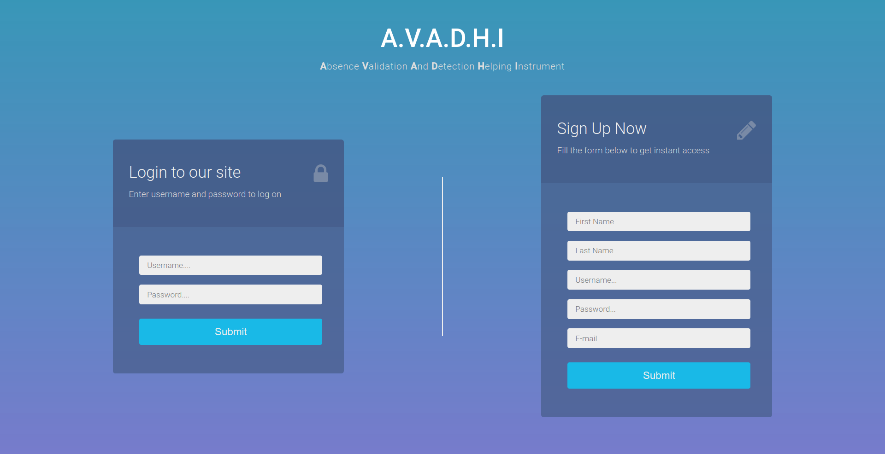
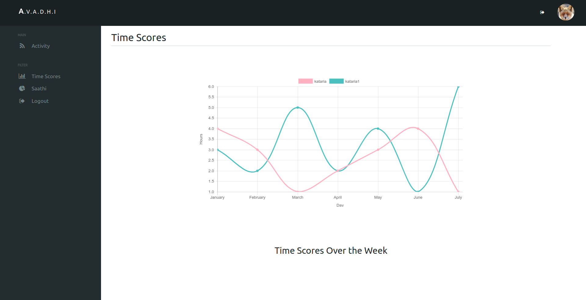
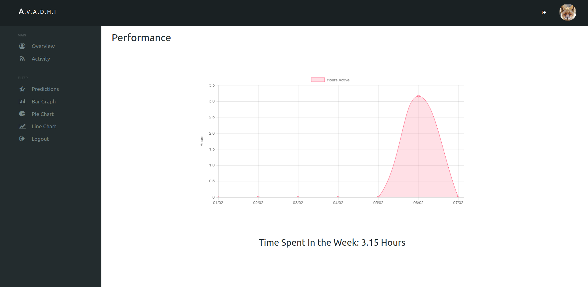
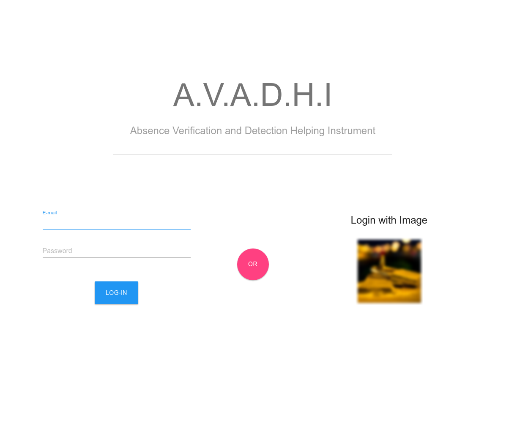
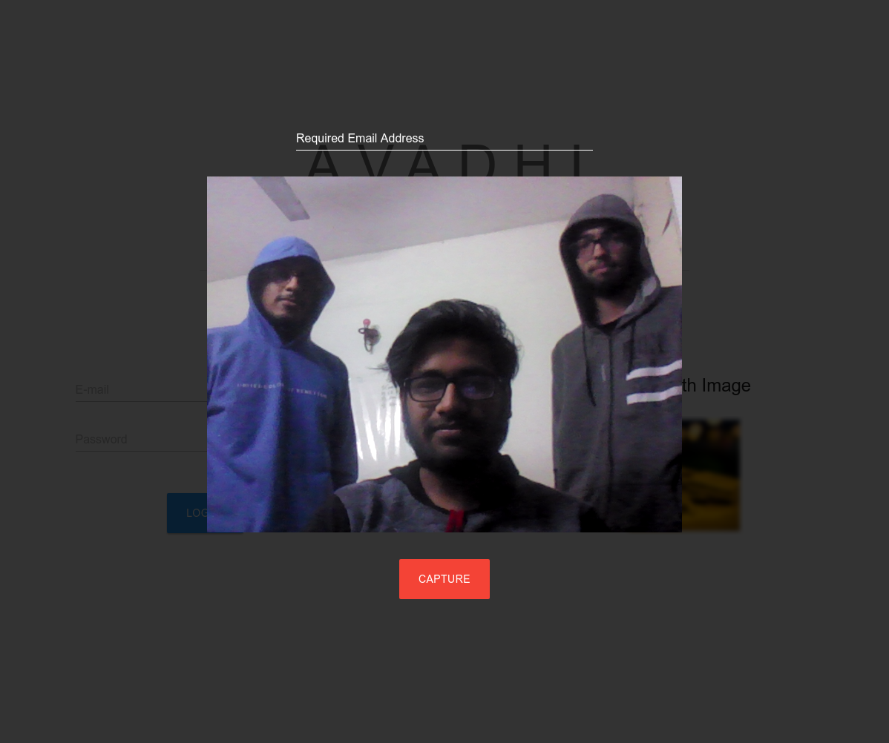

# A.V.A.D.H.I

**A**bsence **V**erification and **D**etection **H**elping **I**nstrument.

[A.V.A.D.H.I Video presentation link](https://www.youtube.com/watch?v=YWZpV6OOou0)

A.V.A.D.H.I, an application developed for Microsoft code.fun.do hackathon. An attempt to support **Digital India** by curbing the problem of false attendance. Every year government loses a lot of money due to this, wages are paid for people who don't exist or are not regular. Digital India aims at providing elegent solutions to day to day problems with the help of technology and so does our app.

Mapping real life problems with theoretical knowledege has proven to be such a boon for the society, we use this as a motivation towards developing AVADHI which uses the client server interface analogy to help us deal with presence of officials at workplaces.

### Core

The core of **AVADHI** consists of scripts and application which detects the presence of users with their virtual identity, which in our model is `mac_address`. We map a user to his mac-address to get the information we need about him, like current presence, past behaviours etc. The main script consists of a broadcaster running on **UDP** protocol which sends UDP broadcast to the subnet every few minutes. Users responds with a TCP connection to the server providing sever the details it needs to know about the user most importantly the **mac_address**. Client application are provided in various forms such as Desktop application, Web Application and Mobile Application. We also aim to provide an IOT based client for the same in near future.

The responses by clients are logged into a central database hosted on **Microsoft Azure Cloud** which can then be accessed by other applications to provide user a unique experince.

Since clients in no way other than storing data into cloud are connected directly to the outer world, this app can be packaged as an ecosystem which in turn can then be used by anyone all around the globe.

### Workflow

On a higher lever the app works on client-sever analogy. Each worker has to register himself first with the central server giving all the necessery information required. A web based login portal is provided for the same which requires user to register with their mac-address and Image. Each worker will have a platform independent application installed and configured on their system.

Due to such a large diversity among the userbase we currently provide two main source of these application:

* Web Appliaction
* Desktop Application

We aim at providing more mobile and handy solutions for the same such as mobile appliactions and IoT based devices.

#### Web Portal

A web portal is provided to all the clients where they can register themselves for avadhi. This web portal contains a login signup system for users, a dashboard with grphical and textual analytics of their presence in the workplace. To promote healthy competitions among fellow workers we also provide a leaderboard which keeps track of most active members.

A separate panel for admins is also provided where they can keep track of presence of workers in the workplace. Keeping in mind the amount to which the data terrain for the app can grow we have also implemented a `bot` to assist admins with their access to the portal. The bot is built using **Microsoft Bot Framework** and also uses **Microsoft speech to text API**.

#### Desktop Application

A cross-platform desktop application had already been implemented with tons of feature to assist AVADHI. Desktop app consists of a login portal that user had to be logged in with in order to make his attendance count. There are two login methods provided with the application :

* Password based login
	Uses the web based api provided by central server in order to log in user. It is similar to the web login portal of AVADHI.

* Image based login
	It uses **Microsoft Face API** to verify the user, it takes user picture using the device web cam and matches it against the actual image of the user trying to login with the email.

If user passes the above login check, he is redirected to the dashboard. Dashboard takes images of user at regular intervals. Any three consecutive fails in face matching results to auto logout of user which if then followed by a desktop lock and wifi freeze. This whole ecosystem provides a reliable method for tracking the presence of the individual using technological advancments.

_Spot Pr0x3 ^_

#### Future Goals

The aim of A.V.A.D.H.I is to make presence detection, verification reliable and easy. We are a long way from where we started, but there is a lot to do to improve. Our main aim would be to scale the app more and make it more accessible to even those coming from less technological backgrounds. This would include a more wider support towards client base and a more reliable central-server. One of the major future goals of A.V.A.D.H.I is to make an API which can help other developers to analyse the data and work with it. A list of goals is summarised below.

- [x] Create an android client for A.V.A.D.H.I

- [ ] Create an IoT based solution for A.V.A.D.H.I to make it more accessible and less resource sensitive.

- [x] Develop an API for A.V.A.D.H.I

